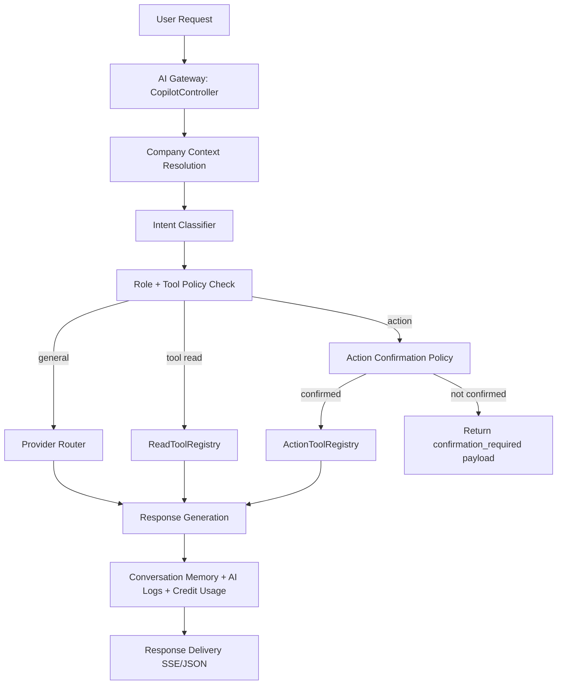
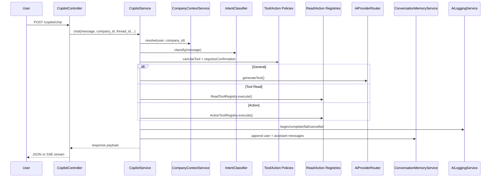

# Factory23 AI System Architecture

## 1. Executive Overview
Factory23 AI is the platform's operational copilot that helps teams retrieve insights, execute approved actions, and automate repeatable workflows across CRM, tasks, projects, meetings, attendance, payroll, tracking, and executive reporting.

Why it exists:
- Reduce decision latency for managers and supervisors.
- Reduce manual administrative work through guided action execution.
- Keep operational answers and actions within strict company and role boundaries.

Business outcomes:
- Faster visibility into overdue work and risk.
- More consistent execution of operational routines.
- Lower coordination overhead via AI-assisted scheduling and notification workflows.
- Scalable executive reporting via queued generation.

## 2. Architecture Overview

### AI Gateway Layer
Primary gateway responsibilities are implemented in `CopilotController` and `CopilotService`.

Responsibilities:
- Accept and validate chat/action requests.
- Resolve tenant context and role.
- Classify intent (general/tool/action).
- Enforce tool policy and action confirmation policy.
- Route read/action requests to controlled tool registries.
- Route general/analysis requests through provider router.
- Persist conversation memory and AI logs.
- Apply PII redaction and credit-limit controls.



## 3. Multi-Brain AI Architecture

### Brain 1 - General Knowledge Intelligence
Purpose:
- Explanations, strategy framing, general operational guidance.
- Non-tool conversational prompts.

Routing:
- `IntentClassifier` returns `general` when no explicit tool/action pattern matches.
- `CopilotService::resolveGeneralResponse` uses `AiProviderRouter->generateText`.

Providers:
- Primary: OpenAI (`AI_PROVIDER=openai`, default model `gpt-4.1-mini`).
- Fallback: Claude (`AI_FALLBACK_PROVIDER=claude`, analyst model default `claude-3-5-sonnet-latest`).

### Brain 2 - Company Intelligence (Read Tools)
Purpose:
- Tenant-scoped data retrieval and analysis from internal services.

Current implemented read tools:
- `crm.top_leads`
- `tasks.overdue`
- `projects.at_risk_summary`
- `attendance.today_summary`
- `meetings.today`
- `tracking.active_agents` (management roles)
- `dashboard.overview`

Execution:
- `ReadToolRegistry` calls domain services/models and returns structured payloads and source tags.

Isolation:
- All read tools execute under resolved company context and role-scoped constraints.

### Brain 3 - Action & Automation Engine
Purpose:
- Controlled operational write actions with explicit policy boundaries.

Current implemented action tools:
- `tasks.create`
- `tasks.reassign`
- `meetings.schedule`
- `notifications.send`
- `projects.create`

Safety mechanisms:
- Role policy gate (`ToolPolicyService`).
- Confirmation gate (`ActionConfirmationPolicyService`).
- Optional idempotency key replay protection.
- Validation per action payload in `ActionToolRegistry`.
- Queue-backed automation execution via `ExecuteAutomationRuleJob`.

## 4. AI Provider Strategy

Current providers:
- OpenAI provider (`OpenAiProvider`)
- Claude provider (`ClaudeProvider`)
- Routing and failover (`AiProviderRouter`)

Failover behavior:
- Router orders providers by `AI_PROVIDER` then `AI_FALLBACK_PROVIDER`.
- If provider is not configured or returns null/failed result, router tries next provider.
- No separate exponential retry loop is implemented in router; failover is provider-sequence based.

Timeout handling:
- Providers use `AI_REQUEST_TIMEOUT_MS` (converted to HTTP timeout seconds).

## 5. Environment Configuration (AI)

```env
AI_PROVIDER=openai
AI_FALLBACK_PROVIDER=claude

AI_DEFAULT_MODEL=gpt-4.1-mini
AI_EXEC_MODEL=gpt-4.1-mini
AI_ANALYST_MODEL=claude-3-5-sonnet-latest

AI_REQUEST_TIMEOUT_MS=30000
AI_MAX_TOKENS=4000

AI_ENABLE_STREAMING=true
AI_ENABLE_ACTIONS=true

AI_MONTHLY_ORG_CREDIT_LIMIT=0
AI_PII_REDACTION_ENABLED=true

OPENAI_API_KEY=
OPENAI_BASE_URL=https://api.openai.com/v1
OPENAI_MODEL=gpt-4.1-mini
OPENAI_AUDIO_MODEL=gpt-4o-mini-transcribe

ANTHROPIC_API_KEY=
ANTHROPIC_BASE_URL=https://api.anthropic.com/v1
ANTHROPIC_VERSION=2023-06-01
CLAUDE_MODEL=claude-3-5-sonnet-latest
```

Note:
- `AI_EXEC_MODEL` is the implemented variable name.
- `AI_PII_REDACTION_ENABLED` is the implemented variable name.

## 6. AI Request Lifecycle



## 7. Tenant Security Architecture

Organization isolation:
- Company context resolution is centralized in `CompanyContextService`.
- User must belong to selected active company membership (`company_users`).
- If `company_id` is absent, latest active membership is selected.
- If membership missing, validation error blocks request.

Cross-tenant protection:
- Tool queries include `company_id` constraints.
- Automation and report status keys are company+user scoped.
- Thread keys are company+user+thread scoped.

## 8. Role-Based AI Permissions

Allowed role groups:
- Management (`owner`, `admin`, `supervisor`): read + action tools.
- Agent: limited read tools only.

Current policy map:
- Agent cannot access `tracking.active_agents` and all action tools.
- Management can use read tools and action tools.

## 9. AI Tool Framework Summary

Read tool framework:
- Purpose: deterministic, secure retrieval from platform services.
- Output: `{summary, payload, sources}` for traceability.

Action tool framework:
- Purpose: validated and policy-checked write operations.
- Requires explicit confirmation for all current action tools.
- Optional idempotency to avoid duplicate execution.

Automation framework:
- NL prompt translated to structured rule JSON.
- Rule validated against action schema + role policy.
- Persisted in `ai_automation_rules`.
- Queue execution with membership and policy re-check.

## 10. AI Memory & Context System

Context builder:
- Company and role context from `CompanyContextService`.

Conversation memory:
- Redis-backed thread storage (`copilot:thread:{company}:{user}:{thread}`).
- Index key for list retrieval (`copilot:threads:{company}:{user}`).
- TTL: 7 days.

## 11. AI Logging & Audit System

Logging model:
- `AiLog` captures provider, model, prompt metadata, token estimates, cost estimate, status, execution time, intent type, tool name, error details.

Lifecycle:
- `AiLoggingService::begin` on request start.
- `complete/fail/timeout/cancelled` based on outcome.

Retention:
- Command: `ai:prune-logs --days=30`
- Scheduled daily at 03:00.

## 12. AI Analytics & Health

Admin surfaces:
- `/admin/ai` overview.
- `/admin/ai/analytics` time-range analytics.
- `/admin/ai/logs` searchable log viewer.
- `/admin/ai/health` provider/redis/queue health checks.

## 13. Cost Management

Mechanisms in place:
- Credit bucket per org-month (`copilot:usage:{company}:{yyyy_mm}` in cache).
- Hard stop when `AI_MONTHLY_ORG_CREDIT_LIMIT` exceeded.
- Provider/model token-cost estimation in `AiLog::estimateCost`.

## 14. Reporting System

Weekly executive summary:
- Queue request endpoint creates report ID and status cache.
- Job `GenerateWeeklyExecutiveSummaryJob` executes async generation.
- Realtime progress event: `copilot.reports.weekly.progress`.
- Download endpoint streams JSON output.

## 15. Real-Time Capabilities Integrated

Supported today:
- GPS: active agent snapshots via read tool.
- Attendance summary read tool.
- Payroll metrics included in executive context/forecast.
- Meeting retrieval and scheduling actions.

## 16. Monitoring & Troubleshooting Foundation

System health checks include:
- OpenAI reachability/auth/quota state.
- Claude reachability/auth/quota state.
- Redis read/write availability.
- Queue pending/failed counts.

## 17. Deployment & Production Readiness

Required services:
- API app container.
- Redis cache/queue backend.
- Queue workers + scheduler.
- OpenAI and/or Claude API credentials.

AI env propagation:
- Docker compose injects AI provider/model/key values into app, queue worker, and scheduler services.

## 18. Future Roadmap Alignment

Already scaffolded:
- Voice transcription endpoint.
- File analysis endpoint (PDF/XLSX/CSV acceptance + placeholder analysis).
- Transcript summarization endpoint.
- Forecast recommendations endpoint.

Next expected evolution:
- Deeper document intelligence pipelines.
- Expanded predictive/optimization models.
- More module-specific action tools and governance policies.
