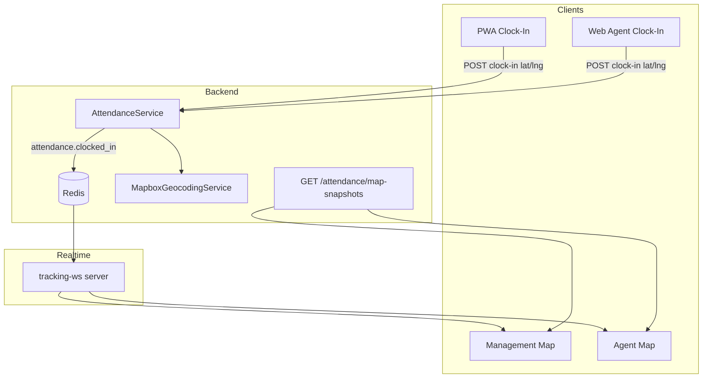

# Clock-In Location on Map — Research & Implementation Plan

## Executive Summary

**Good news:** Most of the foundation is already in place. Clock-in already captures GPS coordinates and stores them in the database. What's missing is a **map-facing API**, **real-time propagation**, and **map UI** to surface those pins.

The right mental model is:

| Layer | Live Feeds (existing) | Clocked In (new) |
|-------|----------------------|------------------|
| Purpose | Active task GPS tracking | Static attendance snapshot |
| Marker behavior | Moves in real time | Fixed at clock-in location |
| Data source | `TaskTrackingService` + WebSocket | `AttendanceService` + new endpoint |
| Who sees it | Management: all agents; Agent: own tasks | Management: all clocked-in; Agent: own pin |

These should stay **separate** — not merged into Live Feeds — so supervisors don't confuse "on a task" with "clocked in for the day."

---

## Current State

### Attendance — Already Captures Location

`AttendanceService::clockIn()` stores coordinates in JSON metadata:

```php
'metadata' => [
    'clock_in_latitude' => $data['latitude'] ?? null,
    'clock_in_longitude' => $data['longitude'] ?? null,
],
```

Clock-out stores `clock_out_latitude` / `clock_out_longitude` similarly.

**Clients:**

| Surface | Location handling |
|---------|-------------------|
| **PWA** (`ClockInModal`) | Requires GPS via `useCurrentLocation` — good |
| **Web agent** (`attendance-view-agent.tsx`) | Gets GPS but **falls back to `(0, 0)`** on failure — bad |
| **Management** | No clock-in; shows raw lat/lng in agent history only |

### Map — Mature Mapbox Integration, No Attendance Link

| Surface | Route | Tabs / features |
|---------|-------|-----------------|
| Management | `/map` | **Live Feeds** + **Businesses** |
| Agent web | `/agent/map` | Task tracking + pinned locations |
| PWA | `/map` | Task navigation + destinations |

Mapbox is already used for tiles, geocoding, directions, and custom HTML markers (`lib/tracking/map-visualization.ts`, `lib/map/saved-location-marker.ts`).

### Real-Time — Tracking Only, Not Attendance

- WebSocket relay: `backend/realtime-server/`
- Redis channels: `factory23.tracking.company.{id}`
- Events: `tracking.task.started`, `tracking.location.updated`, etc.
- **No attendance events** are published today

### Management API Gap

`GET /api/v1/attendance/records` returns agent list but **drops metadata** (no lat/lng). The map cannot use the existing management records endpoint without changes.

### Bugs to Fix Alongside This Feature

1. **PWA sends `timestamp`, backend expects `recorded_at`** — server time is used instead of client time
2. **Web agent `(0, 0)` fallback** — creates bogus pins in the Gulf of Guinea
3. **No server-side reverse geocode** at clock-in — address is raw coordinates in UI

---

## Recommended Architecture



---

## Phase 1 — Backend (Foundation)

### 1A. Dedicated Map Snapshots Endpoint

Add a purpose-built endpoint instead of overloading the paginated records list:

```
GET /api/v1/attendance/map-snapshots
  ?company_id=…
  &date=2026-07-07          (default: today in company timezone)

GET /api/v1/agent/attendance/map-snapshot
  ?company_id=…
```

**Response shape:**

```typescript
type AttendanceMapSnapshot = {
  date: string;
  items: Array<{
    user_id: number;
    attendance_record_id: number;
    agent_name: string;
    avatar_url: string | null;
    clock_in_at: string;
    clock_out_at: string | null;       // null = still clocked in
    status: "present" | "late";
    is_late: boolean;
    latitude: number;
    longitude: number;
    address: string | null;            // reverse-geocoded
    zone: string | null;
  }>;
};
```

**Query logic:**

- `clock_in_at IS NOT NULL`
- `clock_out_at IS NULL` (currently clocked in) — or include clocked-out with a `include_clocked_out` flag for history replay
- `latitude/longitude IS NOT NULL` (exclude records without location)
- Scoped by company + role (management: all agents; agent: own record only)

### 1B. Enrich Metadata at Clock-In

On `clockIn()`, after saving coordinates:

1. Call existing `MapboxGeocodingService` for reverse geocode
2. Store in metadata:

```json
{
  "clock_in_latitude": 6.5244,
  "clock_in_longitude": 3.3792,
  "clock_in_address": "12 Broad St, Lagos Island, Lagos",
  "clock_in_accuracy_m": 12
}
```

Optional later: promote lat/lng to indexed columns for performance at scale. Metadata is fine for v1.

### 1C. Validate Location on Clock-In

Make `latitude` and `longitude` **required** on clock-in (reject null / 0,0). Align web agent with PWA behavior.

### 1D. Fix PWA Payload

Map `timestamp` → `recorded_at` in `the-factory-agent-pwa/src/features/attendance/api.ts`.

---

## Phase 2 — Real-Time Updates

Reuse the existing WebSocket infrastructure rather than building a second connection.

### Publish Events from `AttendanceService`

After successful clock-in/out:

```json
{
  "event": "attendance.clocked_in",
  "version": 1,
  "company_id": 42,
  "user_id": 7,
  "task_id": null,
  "occurred_at": "2026-07-07T08:02:00Z",
  "data": {
    "attendance_record_id": 123,
    "latitude": 6.5244,
    "longitude": 3.3792,
    "address": "12 Broad St, Lagos",
    "status": "late",
    "agent_name": "Femi Adebayo",
    "avatar_url": "…"
  }
}
```

Redis channel: `factory23.tracking.company.{companyId}` (same prefix — realtime-server already subscribes to `*.company.*`)

`shouldDeliverEvent()` in `filtering.js` already works:

- **Management** → all company events
- **Agent** → own `user_id` events

No realtime-server changes needed if you use the same Redis prefix and envelope shape.

### Frontend Hook

Extend `useTrackingWebSocket` (or add `useAttendanceMapStore`) to handle:

- `attendance.clocked_in` → add/update pin
- `attendance.clocked_out` → remove pin (or grey it out)

**Fallback polling:** every 60s when the "Clocked In" tab is active and WebSocket is disconnected (same pattern as tracking's 25s poll).

---

## Phase 3 — Map UI

### 3A. Management Map — New "Clocked In" Tab

In `components/map/map-view.tsx`, extend the left panel:

```
[ Live Feeds ] [ Clocked In ] [ Businesses ]
```

**"Clocked In" tab:**

- List agents currently clocked in (avatar, name, time, late badge, address)
- Search/filter by name
- Click row → `map.flyTo({ center, zoom: 15 })` + popup
- Empty state: "No agents clocked in today"

**Map markers:**

- New marker type: `createClockInMarkerElement()` in `lib/tracking/map-visualization.ts` or `lib/map/attendance-marker.ts`
- Visual distinction from Live Feeds:
  - **Green** halo = on time
  - **Orange** halo = late
  - Clock icon badge (not task icon)
  - **Static** pin (no animation between positions)
- Implementation: GeoJSON source + Mapbox symbol layer, or HTML `mapboxgl.Marker` (consistent with saved locations)
- Clustering via Supercluster when zoomed out (reuse `SavedLocationsLayer` pattern)

**Popup content:**

- Agent name + avatar
- Clock-in time + status
- Address
- "View attendance history" link

### 3B. Agent Web Map (`/agent/map`)

- On load: `GET /agent/attendance/map-snapshot`
- If clocked in with coordinates → show own pin
- Optional banner after clock-in: "You clocked in at [address] — View on map"
- Do **not** show other agents' pins (role-scoped API)

### 3C. PWA Map (`the-factory-agent-pwa/app/(agent)/map/page.tsx`)

Same as agent web:

- Fetch own snapshot on map mount
- Show own clock-in pin
- After `ClockInModal` success → toast with "View on map" action linking to `/map?highlight=clock-in`

### 3D. Cross-Linking

| From | To |
|------|-----|
| Attendance management list | Map with `?tab=clocked-in&agent={userId}` |
| Map popup | `/operations/attendance` filtered to agent |
| Agent attendance page | `/agent/map?highlight=clock-in` |
| Dashboard widget | Count of clocked-in agents + link to map tab |

---

## Mapbox APIs Required

| API | Purpose | Already in codebase? |
|-----|---------|---------------------|
| **Mapbox GL JS** | Render map + markers | Yes |
| **Geocoding v5 (reverse)** | lat/lng → address at clock-in | Yes (`MapboxGeocodingService`, `reverseGeocodeWithMapbox`) |
| **Supercluster** | Cluster many pins when zoomed out | Yes (saved locations) |
| Directions | Not needed | — |
| Mapbox Static Images | Optional thumbnails in list | No (nice-to-have) |

No new Mapbox products are required.

---

## File Change Map (Implementation Guide)

### Backend

| File | Change |
|------|--------|
| `AttendanceService.php` | Publish Redis events; reverse geocode on clock-in |
| `AttendanceMapController.php` (new) | Map snapshots endpoints |
| `routes/api.php` | Register new routes |
| `ClockInRequest.php` | Require lat/lng; reject 0,0 |
| `AttendanceApiTest.php` | Tests for map snapshots + events |

### Main Frontend

| File | Change |
|------|--------|
| `lib/api/attendance.ts` | `listAttendanceMapSnapshots()` |
| `hooks/use-attendance-map.ts` (new) | React Query + WS integration |
| `lib/map/attendance-marker.ts` (new) | Marker element factory |
| `components/map/map-view.tsx` | "Clocked In" tab + layer |
| `components/map/agent-map-view.tsx` | Own clock-in pin |
| `hooks/use-tracking-ws.ts` | Handle `attendance.*` events |
| `store/tracking.ts` or new store | `clockedInAgents` state |
| `components/operations/attendance-view-agent.tsx` | Remove 0,0 fallback; link to map |

### PWA

| File | Change |
|------|--------|
| `features/attendance/api.ts` | Fix `recorded_at` |
| `features/attendance/components/ClockInModal.tsx` | "View on map" after success |
| `app/(agent)/map/page.tsx` | Own clock-in pin layer |
| `features/attendance/api.ts` | `getMapSnapshot()` |

---

## Phased Rollout

### MVP (1–2 days)

1. Map snapshots API (management + agent)
2. Include lat/lng + address in response
3. "Clocked In" tab on management map with static markers
4. Agent sees own pin on web + PWA maps
5. Fix PWA `recorded_at` + web `(0,0)` fallback

### V1.1 (next iteration)

1. Real-time WebSocket events on clock-in/out
2. Cross-links (attendance list ↔ map)
3. Clustering for dense areas
4. Optional: clock-out pin (different color) for audit trail

### V2 (future)

1. Promote lat/lng to indexed DB columns
2. Geofence validation ("must clock in within X meters of assigned zone")
3. AI copilot tool: `attendance.map_summary`
4. Dashboard widget: "12 agents clocked in" with mini-map

---

## Design Decisions

### Why a Separate Tab, Not Live Feeds?

Live Feeds = **moving** agents on active tasks. Clock-in = **static** attendance snapshot. Mixing them confuses supervisors and creates duplicate markers when an agent is both clocked in and on a task.

### Why a Dedicated API, Not Extend `/attendance/records`?

The records endpoint is paginated, date-ranged, and omits coordinates. Map needs a lightweight, today-focused, geo-enriched snapshot. A dedicated endpoint is clearer and cacheable (`staleTime: 30s`).

### Why Reuse the Tracking WebSocket?

One connection, one auth flow, one Redis relay. Attendance events are infrequent (a few per agent per day) vs. GPS pings (every few seconds). Filtering already supports role-based delivery.

### Why Static Pins, Not Live GPS After Clock-In?

Clock-in location is a **compliance/attendance record** — where the agent was when they started their day. Live GPS after that belongs to task tracking. Keeping them separate is legally and operationally cleaner.

---

## Risks & Mitigations

| Risk | Mitigation |
|------|-----------|
| Missing GPS permission | Block clock-in without location (PWA already does this) |
| Offline clock-in (PWA) | Queue with coordinates; pin appears after sync |
| `(0, 0)` bad data | Backend validation + data cleanup migration |
| Map performance with 100+ agents | Supercluster clustering; only load today's active |
| Google Maps provider path | Mirror marker logic in Google branch of `map-view.tsx` (already dual-provider) |

---

## Recommendation

Proceed in this order:

1. **Backend first** — map snapshots API + metadata enrichment + validation fixes
2. **Management map** — "Clocked In" tab (highest value for supervisors)
3. **Agent surfaces** — own pin on web + PWA maps
4. **Real-time** — WebSocket events for instant updates
5. **Polish** — cross-links, clustering, dashboard widget

This builds on existing patterns (attendance metadata, Mapbox markers, Redis/WebSocket relay, role-based filtering) without over-engineering, and leaves clear extension points for geofencing and compliance later.

---

## Existing Codebase Reference

### Attendance Module

- **Backend service:** `backend/src/app/Services/Attendance/AttendanceService.php`
- **Agent controller:** `backend/src/app/Http/Controllers/Api/V1/Attendance/AttendanceAgentController.php`
- **Management controller:** `backend/src/app/Http/Controllers/Api/V1/Attendance/AttendanceManagementController.php`
- **Request validation:** `backend/src/app/Http/Requests/Attendance/ClockInRequest.php`
- **API resource:** `backend/src/app/Http/Resources/AttendanceRecordResource.php`
- **Frontend API client:** `lib/api/attendance.ts`
- **Frontend hooks:** `hooks/use-attendance.ts`
- **Agent web UI:** `components/operations/attendance-view-agent.tsx`
- **Management UI:** `components/operations/attendance-view.tsx`
- **PWA feature:** `the-factory-agent-pwa/src/features/attendance/`

### Map Module

- **Management map:** `components/map/map-view.tsx`
- **Agent web map:** `components/map/agent-map-view.tsx`
- **PWA map:** `the-factory-agent-pwa/app/(agent)/map/page.tsx`
- **Marker utilities:** `lib/tracking/map-visualization.ts`, `lib/map/saved-location-marker.ts`
- **WebSocket hook:** `hooks/use-tracking-ws.ts`
- **Tracking store:** `store/tracking.ts`
- **Realtime server:** `backend/realtime-server/`
- **Geocoding:** `lib/utils/geocoding.ts`, `backend/src/app/Services/Location/MapboxGeocodingService.php`

### API Endpoints (Existing)

**Agent:**

| Method | Path | Description |
|--------|------|-------------|
| `GET` | `/api/v1/agent/attendance/today` | Today's status |
| `POST` | `/api/v1/agent/attendance/clock-in` | Record clock-in |
| `POST` | `/api/v1/agent/attendance/clock-out` | Record clock-out |
| `GET` | `/api/v1/agent/attendance/history` | Personal history |
| `GET` | `/api/v1/agent/attendance/stats` | Monthly stats |

**Management:**

| Method | Path | Description |
|--------|------|-------------|
| `GET` | `/api/v1/attendance/records` | Paginated agent list |
| `GET` | `/api/v1/attendance/metrics` | Daily workforce snapshot |
| `GET` | `/api/v1/attendance/agents/{agent}/history` | Per-agent history |

### Roles & Access

| Action | Roles |
|--------|-------|
| Clock in / out | **Agent** only |
| View own today/history/stats | **Agent** |
| Attendance settings, metrics, records | **Owner, Admin, Supervisor** |
| Management map (`/map`) | **Owner, Admin, Supervisor** |
| Agent map (`/agent/map`) | **Agent** |
