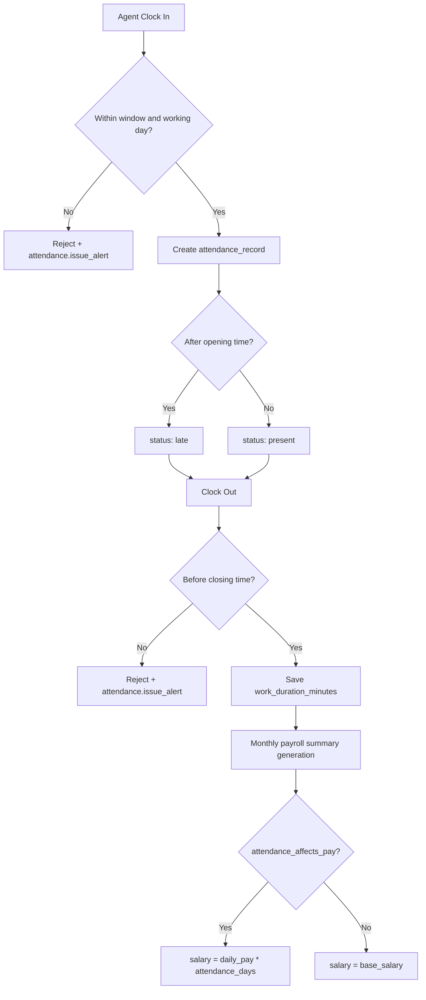

# Attendance Backend + Payroll Integration (API)

## Overview
This module introduces production attendance tracking with payroll impact support:
- company-level attendance settings
- agent clock-in/clock-out lifecycle
- auto clock-out scheduler
- management attendance analytics and list APIs
- monthly attendance payroll summaries based on payroll settings

## Data Model
- `attendance_settings`: one row per company
- `attendance_records`: one row per user/company/day
- `attendance_payroll_summaries`: one row per user/company/month

## Access Rules
- Management (`owner`, `admin`, `supervisor`):
  - configure attendance settings
  - view metrics and attendance records
  - generate/list monthly attendance payroll summaries
- Agent:
  - clock-in/clock-out
  - view own attendance status/history/stats
  - view own monthly attendance payroll summary

## Endpoints

### Management endpoints
- `GET /api/v1/attendance/settings`
- `PUT /api/v1/attendance/settings`
- `GET /api/v1/attendance/metrics`
- `GET /api/v1/attendance/records`
- `GET /api/v1/attendance/payroll-summaries`
- `POST /api/v1/attendance/payroll-summaries/generate`

Equivalent canonical routes are available under:
- `/api/v1/admin/attendance/*`

### Agent endpoints
- `GET /api/v1/attendance/today`
- `POST /api/v1/attendance/clock-in`
- `POST /api/v1/attendance/clock-out`
- `GET /api/v1/attendance/history`
- `GET /api/v1/attendance/stats`
- `GET /api/v1/attendance/payroll-summary`

Equivalent canonical routes are available under:
- `/api/v1/agent/attendance/*`

### Attendance records filtering notes
- `GET /api/v1/attendance/records` supports:
  - `status`: `present`, `late`, `auto_clocked_out`, `clocked_out`, `absent`
  - `role`: `agent`, `supervisor`
  - `search`, `date`, `per_page`, `page`
- `status=present` returns active attendance records including late and auto-clocked-out cases.
- `status=clocked_out` returns records with a populated `clock_out_at`.
- Each item includes `avatar_url` for direct frontend rendering.
- Pagination metadata includes `current_page`, `last_page`, and `total`.

## Request Contracts

### Update settings
`PUT /api/v1/attendance/settings`

```json
{
  "company_id": "FAC-ACME-001",
  "opening_time": "09:00",
  "closing_time": "17:00",
  "working_days": ["monday", "tuesday", "wednesday", "thursday", "friday"],
  "clockin_window_minutes": 15,
  "auto_clockout_enabled": true
}
```

### Clock-in
`POST /api/v1/attendance/clock-in`

```json
{
  "company_id": 1,
  "recorded_at": "2026-06-01 08:50:00",
  "latitude": 6.5244,
  "longitude": 3.3792
}
```

### Clock-out
`POST /api/v1/attendance/clock-out`

```json
{
  "company_id": 1,
  "recorded_at": "2026-06-01 16:30:00",
  "latitude": 6.5244,
  "longitude": 3.3792
}
```

### Generate monthly payroll summaries
`POST /api/v1/attendance/payroll-summaries/generate`

```json
{
  "company_id": 1,
  "year": 2026,
  "month": 6
}
```

## Business Rules
- Clock-in is allowed only on configured `working_days`.
- Clock-in is blocked before the start window (`opening_time - clockin_window_minutes`).
- Clock-in and clock-out are blocked after `closing_time`.
- Duplicate same-day clock-in/clock-out is blocked.
- Late status is assigned when clock-in occurs after `opening_time`.
- Auto clock-out closes open records at `closing_time` and marks status as `auto_clocked_out`.
- Payroll summary generation:
  - if `payroll_settings.attendance_affects_pay = true`, salary is `daily_pay * attendance_days`
  - otherwise salary uses `base_salary`

## Scheduled Jobs
- `attendance:auto-clockout` every 10 minutes
- `attendance:generate-monthly-payroll` monthly (day 1 at `00:30`)

## Notification Events
- `attendance.settings_updated`
- `attendance.clock_in_success`
- `attendance.clock_out_success`
- `attendance.auto_clock_out`
- `attendance.closed`
- `attendance.issue_alert`
- `payroll.monthly_salary_generated`

## Flow Diagram

