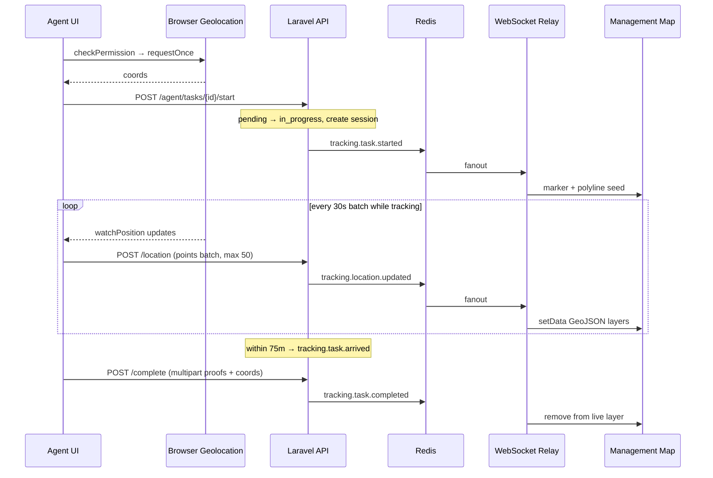

# Live Task Tracking — Implementation Plan (Unified)

> **Canonical plan** — merges `TRACKING_IMPLEMENTATION_PLAN.md` with architecture review findings.  
> **Sources:** `TRACKING_SYSTEM_ARCHITECTURE_REVIEW.md`, `api docs/frontend-guide/task-tracking-realtime.md`, `api docs/features/task-tracking-realtime.md`  
> **Goal:** Replace dummy Mapbox data with task-driven live tracking (REST + WebSocket relay).  
> **Last updated:** 2026-05-15

---

## Table of Contents

1. [Executive Summary](#executive-summary)
2. [What Exists vs What Must Be Built](#what-exists-vs-what-must-be-built)
3. [Documents to Follow vs Ignore](#documents-to-follow-vs-ignore)
4. [Target Architecture](#target-architecture)
5. [Use Cases](#use-cases)
6. [Phase 0 — Environment and API Contracts](#phase-0--environment-and-api-contracts)
7. [Phase 1 — Foundation Layer](#phase-1--foundation-layer)
8. [Phase 2 — Agent Task Flow](#phase-2--agent-task-flow)
9. [Phase 3 — Legacy Operations UI Integration](#phase-3--legacy-operations-ui-integration)
10. [Phase 4 — Dashboard Map Integration](#phase-4--dashboard-map-integration)
11. [Phase 5 — Task Creation and Destination Coordinates](#phase-5--task-creation-and-destination-coordinates)
12. [Phase 6 — Route History (Management)](#phase-6--route-history-management)
13. [Phase 7 — Marker Tags, Status, and Staleness](#phase-7--marker-tags-status-and-staleness)
14. [Phase 8 — Security, Errors, and Edge Cases](#phase-8--security-errors-and-edge-cases)
15. [Phase 9 — Testing Plan](#phase-9--testing-plan)
16. [File Summary](#file-summary)
17. [Key Design Decisions](#key-design-decisions)
18. [Recommended Implementation Order](#recommended-implementation-order)
19. [Backend Reference](#backend-reference)

---

## Executive Summary

The backend delivers **task-driven live tracking**: agent starts tracking on an assigned task → Laravel persists a session and location points → Redis publishes events → Node WebSocket relay fans out to dashboards → Mapbox renders live markers and polylines.

The Next.js frontend is **~5% integrated**: the map is a demo (`INITIAL_AGENTS`, jitter animation). Agent “Commence Task” only patches status to `in_progress` and never calls `POST /start`, so no `TaskTrackingSession` exists and completion will fail.

This plan covers **both** agent entry points:

1. **New** dedicated routes under `app/agent/tasks/*` (primary field experience).
2. **Existing** operations UI (`TaskDetailModal`, `AllTasksView`, project boards) — must be fixed so agents are not blocked on old flows.

---

## What Exists vs What Must Be Built

### Existing (working)

| Area | Location |
|------|----------|
| Mapbox map + custom HTML markers + demo animation | `components/map/map-view.tsx` |
| Auth token (`factory_auth_token` cookie) + company context | `useAuthStore`, `getActiveCompanyContext` |
| API envelope helper | `lib/api/onboarding.ts` → `apiRequest` |
| Agent layout shell | `app/agent/layout.tsx` |
| Task CRUD types and hooks | `lib/api/tasks.ts`, `hooks/use-tasks.ts` |
| Map pages (admin + agent) + dashboard embed | `app/admin/map/page.tsx`, `app/agent/map/page.tsx`, `components/dashboard/dashboard-map.tsx` |
| Backend tracking APIs + WS relay | Laravel + `backend/realtime-server`, nginx `/tracking-ws` |

### Must be built

| Area | Target |
|------|--------|
| Tracking API service | `lib/api/tracking.ts` |
| Tracking types | `types/tracking.ts` (or co-located in API module) |
| Zustand store | `store/tracking.ts` |
| WebSocket client | `hooks/use-tracking-ws.ts` |
| Geolocation wrapper | `hooks/use-geolocation.ts` |
| Location reporter (agent) | `hooks/use-location-reporter.ts` |
| Tracking React Query hooks | `hooks/use-tracking.ts` |
| Agent task hub | `app/agent/tasks/page.tsx`, `[id]/page.tsx`, `[id]/tracking/page.tsx` |
| Permission + completion UI | `LocationPermissionGate`, `CompleteTaskSheet`, `ActiveTrackingBar` |
| Map live layers + history | `map-view.tsx` refactor, `RouteHistoryPanel.tsx` |
| Geocoding on task create | `create-task-modal.tsx` |
| Operations modal fix | `task-detail-modal.tsx` — Commence → start, Done → complete |

---

## Documents to Follow vs Ignore

| Document | Transport | Action |
|----------|-----------|--------|
| `TRACKING_SYSTEM_ARCHITECTURE_REVIEW.md` | Task REST + Node relay | **Follow** |
| `api docs/frontend-guide/task-tracking-realtime.md` | Same | **Follow** |
| `api docs/features/task-tracking-realtime.md` | Same | **Follow** |
| `api docs/features/map-live-tracking.md` | Reverb + `GET /agents/locations` | **Ignore** (not implemented) |
| `docs/map-realtime-tracking-plan.md` | Socket.IO + Maptiler | **Ignore** (superseded) |

---

## Target Architecture



### Roles

| Role | REST | WebSocket |
|------|------|-----------|
| **Agent** | `POST /agent/tasks/{id}/start\|location\|complete`, `GET .../route` | Own `user_id` events only (+ optional `subscribe_task`) |
| **Management** | `GET /admin/tasks/{id}/route`, list `in_progress` tasks | All company events on `factory23.tracking.company.{id}` |

---

## Use Cases

### Agent

| ID | Use case | Entry point | Success criteria |
|----|----------|-------------|------------------|
| A1 | View assigned tasks by status | `app/agent/tasks` tabs | Lists from `GET /agent/tasks?company_id&status=` |
| A2 | Open task detail before tracking | `app/agent/tasks/[id]` | Destination mini-map, metadata, Start/Continue CTA |
| A3 | Grant location with context before browser prompt | `LocationPermissionGate` | Explanation → Allow → native prompt |
| A4 | Recover from denied location | Permission gate `denied` state | Browser-specific instructions, no broken Start |
| A5 | Start tracking on pending task | Tracking page or modal Commence | Single `POST /start` (no separate status PATCH) |
| A6 | Continue tracking on in_progress task without session | Same | `POST /start` if no active session on device |
| A7 | Track while navigating the app | `ActiveTrackingBar` in layout | `use-location-reporter` stays mounted |
| A8 | See live position + destination + 75m zone | `[id]/tracking` Phase B | Map centered, accuracy badge, pulsing dot |
| A9 | Receive arrival notification | Location response or WS | Banner when `arrived: true` |
| A10 | Complete with proofs + final GPS | `CompleteTaskSheet` | Multipart `POST /complete`, ≥1 file |
| A11 | Complete from operations modal | `task-detail-modal.tsx` | Same complete flow, not status-only PATCH |
| A12 | View own route after/during task | Agent map or tracking page | `GET /agent/tasks/{id}/route` |
| A13 | Offline / flaky network | Location reporter queue | Retry flush; cap queue at 100 |
| A14 | Only one active tracking session | Start on second task | 422 → prompt to finish other task |

### Management (admin / supervisor)

| ID | Use case | Entry point | Success criteria |
|----|----------|-------------|------------------|
| M1 | See all in-progress agents on map load | `app/admin/map` | Hydrate from tasks + routes + WS |
| M2 | Live marker movement | WS `tracking.location.updated` | GeoJSON `setData`, no jitter demo |
| M3 | See agent name + task on marker tag | Sidebar + popup | Real assignee + task title |
| M4 | Detect arrival on map | WS `tracking.task.arrived` | Green route / arrived chip |
| M5 | Remove marker on completion | WS `tracking.task.completed` | Remove after 5s delay |
| M6 | Search/filter sidebar agents | Existing search UI | Filter `liveTaskMap` values |
| M7 | Fly to agent on click | `agent-circles` layer click | `flyTo` + detail popup |
| M8 | Stale agent (>2 min no update) | Staleness interval | Grey marker, “Last seen …” |
| M9 | WS disconnect | Polling fallback | Poll routes every 25s until reconnected |
| M10 | View completed task route history | `RouteHistoryPanel` | Admin route API + checkpoint markers |
| M11 | Dashboard compact map preview | `dashboard-map.tsx` | Same store, no mock animation |

### Admin / operations (task setup)

| ID | Use case | Entry point | Success criteria |
|----|----------|-------------|------------------|
| O1 | Create task with geocoded destination | `create-task-modal.tsx` | `latitude`/`longitude` sent to API |
| O2 | Require coords when visit verification on | Create validation | Block save without coords |
| O3 | Assign agent to task | Existing assign flow | Agent can start tracking when assigned |
| O4 | View task detail map (not fake SVG) | `task-detail-modal.tsx` | Mini-map or route preview |

### System / edge

| ID | Use case | Handling |
|----|----------|----------|
| S1 | 401 expired token | Redirect login; stop watcher |
| S2 | 403 wrong role | Toast; no WS spam |
| S3 | 422 validation | Surface `errors` fields |
| S4 | Task reassigned mid-track | Stop reporter on 422 |
| S5 | Poor GPS (>200m accuracy) | Drop point client-side |
| S6 | Co-located markers | Cluster or slight visual offset at high zoom only |
| S7 | Tab backgrounded | Reduce watch frequency; keep 30s batch |

---

## Phase 0 — Environment and API Contracts

**Effort:** 0.5 day

### Environment variables

Add to `.env.local`:

```bash
NEXT_PUBLIC_API_BASE_URL=https://api.thefactory23.com/api/v1
NEXT_PUBLIC_MAPBOX_TOKEN=pk...
# Production: same host as API, nginx path /tracking-ws
NEXT_PUBLIC_TRACKING_WS_URL=wss://api.thefactory23.com/tracking-ws
# Dev example:
# NEXT_PUBLIC_TRACKING_WS_URL=ws://localhost/tracking-ws
```

> **Note:** `TRACKING_IMPLEMENTATION_PLAN.md` used `NEXT_PUBLIC_WS_URL=wss://realtime.thefactory23.com`. Use the URL that matches your deploy. Docker nginx proxies `location /tracking-ws` → realtime service port `8081`. Confirm with ops before production.

### API path convention

| Action | Agent | Management |
|--------|-------|------------|
| List tasks | `GET /agent/tasks?company_id=&status=` | `GET /admin/tasks?...` or `GET /tasks?...` |
| Start / location / complete | `POST /agent/tasks/{id}/start` etc. | N/A |
| Route | `GET /agent/tasks/{id}/route` | `GET /admin/tasks/{id}/route` |

Prefer role-scoped routes for clear 403 behavior. Generic `/api/v1/tasks/...` exists but is less explicit.

### WebSocket authentication

The relay supports **both**:

1. **Query string (recommended for connect):** `?token=...&company_id=...` — authenticates immediately, avoids 10s auth timeout.
2. **Post-connect:** `{ "type": "authenticate", "token": "...", "company_id": 21 }`.

Production: prefer WSS. Be aware query tokens may appear in proxy logs; post-connect auth is acceptable if you control log redaction.

---

## Phase 1 — Foundation Layer

**Effort:** 2–3 days

### 1.1 `lib/api/tracking.ts` (new)

Follows `apiRequest` pattern from `lib/api/onboarding.ts` (same as `tasks.ts`).

| Function | Method | Path | Notes |
|----------|--------|------|-------|
| `listAgentTasks` | GET | `/agent/tasks?company_id=X&status=` | Reuses `TaskApiItem`; separate queries per tab |
| `startTask` | POST | `/agent/tasks/{id}/start` | JSON body |
| `recordLocation` | POST | `/agent/tasks/{id}/location` | Single point or `points[]` (max 50) |
| `completeTask` | POST | `/agent/tasks/{id}/complete` | Raw `fetch` + `FormData` (like `uploadTaskProof`) |
| `getTaskRoute` | GET | `/agent/tasks/{id}/route` or `/admin/tasks/{id}/route` | `include_points`, `limit`; role-aware helper |

**`startTask` payload:**

```json
{
  "company_id": 1,
  "location_permission_granted": true,
  "latitude": 6.4,
  "longitude": 3.39,
  "accuracy_meters": 5.0,
  "recorded_at": "2026-04-29T14:00:00Z"
}
```

**`startTask` response:** `{ task, tracking: TrackingSession, arrived: boolean }`

**`recordLocation` response:** `{ task, tracking, received_points, persisted_points, arrived }`

**`completeTask` FormData fields:** `company_id`, `latitude`, `longitude`, `accuracy_meters`, `recorded_at`, `notes`, `files[]` (≥1 required)

**Types:**

```typescript
export type TrackingSession = {
  id: number;
  task_id: number;
  started_by_user_id: number;
  start_latitude: number;
  start_longitude: number;
  arrival_detected_at: string | null;
  end_recorded_at: string | null;
};

export type LocationPoint = {
  latitude: number;
  longitude: number;
  accuracy_meters?: number | null;
  speed_mps?: number | null;
  heading_degrees?: number | null;
  event_type: "movement" | "start" | "arrival" | "complete";
  is_checkpoint: boolean;
  recorded_at: string;
};

export type TaskRoute = {
  task_id: number;
  company_id: number;
  status: string;
  destination: { latitude: number; longitude: number; radius_meters: number };
  start: { latitude: number; longitude: number; recorded_at: string } | null;
  arrival: { latitude: number; longitude: number; recorded_at: string } | null;
  end: { latitude: number; longitude: number; recorded_at: string } | null;
  summary: { points_count: number; total_distance_meters: number };
  points: LocationPoint[];
  polyline: [number, number][]; // [lng, lat][] for Mapbox
};
```

### 1.2 `hooks/use-tracking.ts` (new)

React Query mutations/queries wrapping the API:

- `useStartTracking`, `useRecordLocation`, `useCompleteTracking`, `useTaskRoute`, `useAgentTasksList`
- Invalidate `TASK_KEYS` from `hooks/use-tasks.ts` on start/complete

### 1.3 `store/tracking.ts` (new)

Zustand, **no persistence** (ephemeral session state).

```typescript
export type LiveTaskStatus = "tracking" | "arrived" | "completed";

export interface LiveTaskState {
  taskId: number;
  trackingSessionId: number | null;
  agentId: number;
  agentName: string;
  agentAvatar: string | null;
  taskTitle: string;
  taskAddress?: string;
  lastPosition: [number, number] | null; // [lng, lat]
  polyline: [number, number][];
  status: LiveTaskStatus;
  arrivedAt: string | null;
  lastUpdatedAt: string | null;
  destination: { lat: number; lng: number; radiusMeters: number } | null;
}

export interface TrackingStore {
  liveTaskMap: Record<number, LiveTaskState>;
  activeTrackingTaskId: number | null; // agent device — drives ActiveTrackingBar
  wsStatus: "idle" | "connecting" | "connected" | "reconnecting" | "error";

  upsertTask(taskId: number, partial: Partial<LiveTaskState>): void;
  appendPolylinePoint(taskId: number, point: [number, number]): void;
  markArrived(taskId: number, arrivedAt: string): void;
  markCompleted(taskId: number): void;
  removeTask(taskId: number): void;
  hydrateTasks(tasks: LiveTaskState[]): void;
  setActiveTrackingTaskId(taskId: number | null): void;
  setWsStatus(status: TrackingStore["wsStatus"]): void;
}
```

- `appendPolylinePoint` **caps polyline at 2000 points** (drop oldest) for long shifts.
- `upsertFromWs(envelope)` can wrap the above for WS hook consumption.

### 1.4 `hooks/use-geolocation.ts` (new)

Pure browser geolocation — no tracking/API logic.

```typescript
interface GeolocationState {
  permissionState: "unknown" | "prompt" | "granted" | "denied";
  position: GeolocationPosition["coords"] | null;
  error: GeolocationPositionError | null;
  isWatching: boolean;
}

interface GeolocationActions {
  checkPermission(): Promise<PermissionState>; // does NOT trigger prompt
  requestOnce(): Promise<GeolocationCoordinates>; // triggers prompt if needed
  startWatching(onUpdate: (coords: GeolocationCoordinates) => void): void;
  stopWatching(): void;
}
```

**Implementation:**

- `checkPermission`: `navigator.permissions.query({ name: "geolocation" })`
- `requestOnce`: `getCurrentPosition({ enableHighAccuracy: true, timeout: 10000 })`
- `startWatching`: `watchPosition({ enableHighAccuracy: true, maximumAge: 5000 })`
- `stopWatching`: `clearWatch`
- `PERMISSION_DENIED` (code 1) → `permissionState: "denied"`

**Client quality gates** (before queueing/sending):

- Reject `accuracy > 200` metres
- Reject `(0, 0)` and null island coords
- `enableHighAccuracy: true` when tab foreground; relax when hidden

### 1.5 `hooks/use-location-reporter.ts` (new)

Agent-only. Bridges geolocation → batched API.

```typescript
interface LocationReporterOptions {
  taskId: number;
  companyId: number;
  token: string;
  active: boolean;
  onArrived?: () => void;
}
```

**Behavior:**

- Watcher appends each reading to an internal queue
- **Every 30 seconds**, flush queue via `recordLocation({ company_id, points: [...] })` (max **50** points per request per API)
- On `arrived: true` in response → `onArrived()`
- On network failure → retain queue, retry next flush (cap queue at **100**)
- When `active === false` → stop interval + `stopWatching()`

> **Why 30s batch:** Backend persists points ≥15s or ≥20m apart. Posting every 5s wastes requests (~12/min/agent). ~6 points per 30s batch matches server design and saves battery.

### 1.6 `hooks/use-tracking-ws.ts` (new)

Reads `token` + `companyId` from `useAuthStore` / `getActiveCompanyContext`. Updates `useTrackingStore`.

**Connection lifecycle:**

1. Mount → `new WebSocket(\`${TRACKING_WS_URL}?token=${token}&company_id=${companyId}\`)`
2. `onopen` → `wsStatus = 'connected'`, send `{ type: "ping" }`
3. `onmessage` → route by `type` (see table)
4. `onerror` / `onclose` → `wsStatus = 'reconnecting'`, exponential backoff 1s → 30s max
5. Unmount → close socket, clear timers

**Message routing:**

| Event `type` | Store action |
|--------------|--------------|
| `tracking.task.started` | `upsertTask(id, { status: 'tracking', lastPosition, trackingSessionId })` |
| `tracking.location.updated` | `appendPolylinePoint` + `upsertTask`; if `payload.data.arrived` → `markArrived` |
| `tracking.task.arrived` | `markArrived(id, occurred_at)` |
| `tracking.task.completed` | `markCompleted(id)` → after **5s** → `removeTask(id)` |
| `system.connected` | Log / UI connected indicator |
| `system.auth_required` | Send authenticate message if not query-auth’d |

**Polling fallback:**

If `wsStatus !== 'connected'` for **>30s** and `liveTaskMap` has entries:

- Poll `getTaskRoute` every **25s** per active task
- Hydrate store from route response
- Stop polling when `wsStatus === 'connected'`

Optional control messages: `subscribe_task` / `unsubscribe_task` for agents watching specific tasks.

---

## Phase 2 — Agent Task Flow

**Effort:** 3–4 days — **primary field experience**

### 2.1 `app/agent/tasks/page.tsx` (new)

- Tabs: **Pending** | **In Progress** | **Completed** (default: Pending)
- React Query per tab: `listAgentTasks({ company_id, status })`
- Task card: title, address, due date (red if overdue), priority badge, status chip
- Actions:
  - Pending → **Start** (green outline) → `/agent/tasks/[id]/tracking`
  - In Progress → **Continue** (blue filled) → `/agent/tasks/[id]/tracking`
  - Completed → **View** (gray) → `/agent/tasks/[id]`

### 2.2 `app/agent/tasks/[id]/page.tsx` (new)

- `getTask(taskId, { company_id })`
- Sections: header (title, priority, status); details (description, due, checklist); **location card** (address + non-interactive Mapbox mini-map with destination pin)
- Bottom CTA: Start / Continue / View by status

### 2.3 `app/agent/tasks/[id]/tracking/page.tsx` (new)

Three phases on one page:

**Phase A — Pre-start**

- `LocationPermissionGate` (see 2.4)
- After grant: “Start Tracking” confirmation with initial position on map

**Phase B — Active tracking**

- After `startTask` succeeds → set `activeTrackingTaskId`, mount reporter
- Full-screen map: current position, destination pin, **75m radius circle**
- Overlays: task title, elapsed time, GPS accuracy (e.g. “±8m”)
- Pulsing dot at agent position
- Arrival banner when `arrived: true` (from API or WS)
- **Complete Task** button: prefer enabled after arrival; optional override after 30-minute timeout (product decision)

**Phase C — Completion**

- `CompleteTaskSheet` slides up (see 2.6)
- Success → toast + navigate to task list

### 2.4 `components/tracking/LocationPermissionGate.tsx` (new)

**Two-step permission flow** — explain before browser prompt.

1. Mount → `checkPermission()` (no native prompt)
2. **`denied`:** “Location blocked” + Chrome/Safari-specific instructions (`navigator.userAgent`). No Start until fixed in browser settings.
3. **`prompt`:** Explanation card → “Allow Location Access” → `requestOnce()` → native prompt
4. **`granted`:** Skip card → `requestOnce()` → proceed to start

**Copy:**

- Heading: “Location access needed”
- Body: “To start this task, we need to track your location so supervisors can monitor your route and confirm you reached the destination. Your location is only shared while this task is active.”
- Buttons: “Allow Location Access” | “Not Now” (back to task detail)

### 2.5 `components/tracking/ActiveTrackingBar.tsx` (new)

Fixed bar above agent nav when `activeTrackingTaskId` is set.

- Shows: truncated task title, “● Tracking” pulsing dot, elapsed time
- Tap → `/agent/tasks/[id]/tracking`
- Mounts **`use-location-reporter`** here (via parent provider) so tracking continues when agent leaves tracking page

**Modify `app/agent/layout.tsx`:** mount `ActiveTrackingBar` + tracking provider.

### 2.6 `components/tracking/CompleteTaskSheet.tsx` (new)

- File/camera upload, ≥1 image required (`minimum_photos_required` from task)
- 3-column preview grid with remove per image
- Optional notes
- Show current GPS confirmation
- Submit → `completeTask` FormData → stop reporter → clear `activeTrackingTaskId`

### 2.7 `components/tracking/active-tracking-provider.tsx` (new, optional)

Coordinates reporter lifecycle, session metadata, and bar visibility. Alternative: fold into layout + store only.

---

## Phase 3 — Legacy Operations UI Integration

**Effort:** 1–2 days — **do not skip**

Agents already use:

- `components/operations/task-detail-modal.tsx` (Commence / Task Done)
- `components/operations/all-tasks-view.tsx` (agent projects page)
- `app/agent/operations/[projectId]/page.tsx`

### 3.1 Fix “Commence Task” → `POST /start`

**Remove** `updateTaskStatus('in_progress')` as the sole Commence action.

**Replace with `handleCommenceAndTrack`:**

1. Verify assigned agent + `pending` or `in_progress`
2. Show `LocationPermissionGate` (inline step or navigate to tracking page)
3. `requestOnce()` → `startTask(...)` with `location_permission_granted: true`
4. Set `activeTrackingTaskId`, start reporter
5. Toast success (+ arrival if `arrived`)

`TaskTrackingService::start()` already promotes `pending` → `in_progress`.

### 3.2 Fix “Task Done” → `POST /complete`

Replace status-only PATCH with `CompleteTaskSheet` or equivalent:

- Proofs + final GPS + notes
- Requires active session (starts with Commence fix)

### 3.3 Task detail map header

Replace fake SVG map in modal with destination mini-map or `useTaskRoute` when session exists.

### 3.4 Deep links

From modal: “Open tracking” → `/agent/tasks/[id]/tracking` for full-screen experience.

---

## Phase 4 — Dashboard Map Integration

**Effort:** 3–4 days

### 4.1 Update `components/map/map-view.tsx`

**Step 1 — Remove demo data**

Delete `INITIAL_AGENTS`, `ROUTE_COORDS`, `jitter()`, and `setInterval` animation.

**Step 2 — WebSocket**

Call `useTrackingWebSocket()` at top level → populates `useTrackingStore`.

**Step 3 — Hydrate on map `load`**

```typescript
const tasks = await listTasks({ company_id, status: "in_progress" }, token);
for (const task of tasks) {
  const route = await getTaskRoute(task.id, { company_id }, token, "admin");
  store.hydrateTasks([buildLiveTaskState(task, route)]);
}
```

**Step 4 — GeoJSON sources (add once on load)**

| Source ID | Type | Content |
|-----------|------|---------|
| `agent-positions` | GeoJSON FeatureCollection | Point per active task (latest position) |
| `task-routes` | GeoJSON FeatureCollection | LineString per task polyline |
| `task-destinations` | GeoJSON FeatureCollection | Point per destination |

| Layer ID | Type | Source | Purpose |
|----------|------|--------|---------|
| `agent-circles` | circle | `agent-positions` | Agent dot, color by status |
| `agent-labels` | symbol | `agent-positions` | Agent name |
| `route-lines` | line | `task-routes` | Blue=tracking, green=arrived, gray=completed |
| `destination-pins` | symbol | `task-destinations` | Purple destination marker |
| `arrival-zones` | circle | `task-destinations` | 75m radius at destination |

**Step 5 — React to store**

```typescript
useEffect(() => {
  if (!mapRef.current) return;
  requestAnimationFrame(() => {
    map.getSource("agent-positions")?.setData(buildAgentsGeoJSON(liveTaskMap));
    map.getSource("task-routes")?.setData(buildRoutesGeoJSON(liveTaskMap));
    map.getSource("task-destinations")?.setData(buildDestinationsGeoJSON(liveTaskMap));
  });
}, [liveTaskMap]);
```

**Step 6 — Sidebar**

Drive “Search Feeds” from `Object.values(liveTaskMap)` — real name, task title, address, status.

**Step 7 — Click behavior**

Click `agent-circles` → `flyTo` + popup with task name, last updated, distance to destination (if computable), arrival status.

### 4.2 Optional file split

```
components/map/
  map-view.tsx           # shell
  map-geojson.ts         # buildAgentsGeoJSON, buildRoutesGeoJSON, ...
  map-sidebar.tsx
  map-task-panel.tsx
```

### 4.3 Agent map page (`app/agent/map/page.tsx`)

- If `activeTrackingTaskId`: show own polyline + destination zone
- Else: empty state + link to `/agent/tasks`
- Consume same store; relay filters other agents for agent role

### 4.4 Compact dashboard map (`components/dashboard/dashboard-map.tsx`)

Pass store context or connect WS in parent so `MapView compact` shows real in-progress positions (read-only, `interactive: false` preserved).

### 4.5 HTML markers vs GeoJSON

- **Default:** GeoJSON layers (scalable, single GPU update).
- **Fallback:** HTML markers only for ≤20 agents if custom tags are required before GeoJSON labels are ready.

Smooth movement: lerp last → new position over ~800ms on update (optional for HTML path).

---

## Phase 5 — Task Creation and Destination Coordinates

**Effort:** 1–2 days

Arrival detection uses `task.latitude` / `task.longitude` copied into `TaskTrackingSession.destination_*`.

### 5.1 Geocode on create (`create-task-modal.tsx`)

- On address/location blur or submit: Mapbox Geocoding API
- Set `latitude`, `longitude` on `createTask` payload
- Optional pin preview mini-map

### 5.2 Validation

- `visit_verification_required === true` → require coordinates
- Geocode failure → warn; allow text-only save with banner “Tracking arrival disabled until coordinates added”

### 5.3 Edit task (future)

Same geocoding when editing existing tasks without coords.

---

## Phase 6 — Route History (Management)

**Effort:** 1 day

### `components/map/RouteHistoryPanel.tsx` (new)

Side drawer when supervisor selects a **completed** task (from operations or map).

- `getTaskRoute(taskId, { company_id }, token, "admin")`
- Draw full polyline + checkpoints:
  - Green = start
  - Yellow = arrival
  - Red = end
- Stats: `summary.total_distance_meters`, duration (start → end), avg speed
- Close → remove overlay, return to live map

Does not interfere with `liveTaskMap` unless explicitly toggled into “history mode”.

---

## Phase 7 — Marker Tags, Status, and Staleness

**Effort:** 0.5–1 day

Marker “tags” = white label chips on map + sidebar rows.

| State | Visual | Subtitle |
|-------|--------|----------|
| Tracking | Green ring / blue route | `En route · {taskTitle}` |
| Arrived | Purple zone + green route | `Arrived` |
| Stale (>2 min no update) | Grey, 50% opacity | `Last seen {relative}` from `lastUpdatedAt` |
| Completed | Removed from live layer | History via `RouteHistoryPanel` |

Run **30s interval** in map shell to mark stale entries without WS traffic.

For `agent-labels` layer: bind `name` + `taskTitle` properties in GeoJSON.

---

## Phase 8 — Security, Errors, and Edge Cases

| Scenario | Handling |
|----------|----------|
| 401 API/WS | Redirect login; `stopWatching`; close WS |
| 403 not assigned | Toast; don’t start reporter |
| 422 `location_permission_granted` | Re-show `LocationPermissionGate` |
| 422 active session exists | Prompt: complete other task or resume |
| 422 terminal task | Disable start |
| GPS denied mid-task | Banner; pause queue; link to settings |
| Tab hidden | `visibilitychange` → lower accuracy / keep 30s flush |
| Reassignment during track | 422 on location → stop reporter, notify user |
| WS down | REST still records; map polls routes every 25s |
| Poor accuracy (>200m) | Drop point, don’t enqueue |
| Token in WS URL | Use query auth for reliability; WSS only in prod |

---

## Phase 9 — Testing Plan

### Manual E2E

1. Admin creates geocoded task, assigns agent.
2. Agent: `/agent/tasks` → Start → permission gate → tracking live.
3. Agent navigates away → `ActiveTrackingBar` visible → locations still upload.
4. Admin map: marker appears, polyline grows, tags correct.
5. Simulate arrival (coords near destination) → banners on agent + map.
6. Complete with proofs → marker removed; task completed.
7. Admin: `RouteHistoryPanel` on completed task → checkpoints + stats.
8. Agent via **modal** Commence on project board → same as above (Phase 3).
9. Disconnect WS → map still updates via polling within ~25s.
10. Deny location → blocked state with instructions.

### Automated

| Area | Tests |
|------|-------|
| Store | `upsertTask`, `appendPolylinePoint` cap at 2000, WS reducer |
| Reporter | Queue flush at 30s, max 50 per batch, retry on failure |
| Geolocation | Permission state machine mocks |
| API | Contract shapes vs `TaskTrackingTest.php` |
| GeoJSON builders | Snapshot FeatureCollections |

---

## File Summary

| File | Action |
|------|--------|
| `.env.local` | Add `NEXT_PUBLIC_TRACKING_WS_URL`, `NEXT_PUBLIC_MAPBOX_TOKEN` |
| `types/tracking.ts` | Create (optional; can live in `lib/api/tracking.ts`) |
| `lib/api/tracking.ts` | Create — 5 API functions + types |
| `hooks/use-tracking.ts` | Create — React Query wrappers |
| `hooks/use-geolocation.ts` | Create |
| `hooks/use-location-reporter.ts` | Create — 30s batch flush |
| `hooks/use-tracking-ws.ts` | Create — WS + reconnect + polling |
| `store/tracking.ts` | Create — Zustand `liveTaskMap` |
| `app/agent/tasks/page.tsx` | Create |
| `app/agent/tasks/[id]/page.tsx` | Create |
| `app/agent/tasks/[id]/tracking/page.tsx` | Create |
| `components/tracking/LocationPermissionGate.tsx` | Create |
| `components/tracking/ActiveTrackingBar.tsx` | Create |
| `components/tracking/CompleteTaskSheet.tsx` | Create |
| `components/tracking/active-tracking-provider.tsx` | Create (recommended) |
| `components/map/map-view.tsx` | Modify — live GeoJSON + remove demo |
| `components/map/RouteHistoryPanel.tsx` | Create |
| `components/map/map-geojson.ts` | Create (optional helpers) |
| `components/operations/task-detail-modal.tsx` | Modify — Commence/start, Done/complete |
| `components/operations/create-task-modal.tsx` | Modify — geocode lat/lng |
| `app/agent/layout.tsx` | Modify — mount bar + provider |
| `components/dashboard/dashboard-map.tsx` | Modify — real store data |

---

## Key Design Decisions

### One “Commence” = start tracking

Never Commence with only `PATCH status`. Always `POST /start` with location permission + coordinates. Backend creates session and moves `pending` → `in_progress`.

### Two agent entry points, one reporter

New `/agent/tasks/*` is primary; operations modal must call the same `startTask` + reporter. Single `activeTrackingTaskId` in store.

### Location permission — two-step flow

`LocationPermissionGate` before `requestOnce()`. Reduces reflexive denials.

### Location reporting — 30-second batch

Watcher collects continuously; API flush every 30s (max 50 points). Matches backend 15s/20m persistence and limits battery/network use.

### GeoJSON over HTML markers (management map)

`setData()` scales to many agents; demo `mapboxgl.Marker` + jitter removed.

### ActiveTrackingBar keeps reporter alive

Reporter mounted in layout tree, not only on tracking page — navigation does not stop uploads.

### Polling fallback is automatic

WS down >30s → poll routes every 25s per live task until reconnected.

### WebSocket auth via query string

Immediate auth on connect; avoids 10s timeout. Use WSS in production.

### Polyline cap at 2000 points

Prevents unbounded memory on long shifts; full history remains on server via route API.

### Complete requires session + proofs

`POST /complete` with multipart files — not `PATCH completed` alone.

---

## Recommended Implementation Order

| Week | Deliverable | Use cases covered |
|------|-------------|-------------------|
| 1 | Phase 1 foundation + `LocationPermissionGate` + `startTask` in tracking page | A3–A6, S3 |
| 2 | `use-location-reporter`, `ActiveTrackingBar`, tracking page Phase B, Phase 3 modal fix | A7–A9, A11, O4 |
| 3 | `CompleteTaskSheet`, complete flow, agent map | A10, A12 |
| 4 | `use-tracking-ws`, store, map hydration + GeoJSON layers | M1–M9, M11 |
| 5 | Geocoding, `RouteHistoryPanel`, staleness, QA | O1–O2, M10, M8, all E2E |

Each week is independently shippable. Week 1–3 deliver agent value without admin map; week 4 delivers supervisor visibility.

---

## Backend Reference

### Endpoints (agent)

```
POST /api/v1/agent/tasks/{task}/start
POST /api/v1/agent/tasks/{task}/location
POST /api/v1/agent/tasks/{task}/complete
GET  /api/v1/agent/tasks/{task}/route?company_id=&include_points=true&limit=500
```

### Endpoints (management)

```
GET /api/v1/admin/tasks/{task}/route?company_id=&include_points=true&limit=500
GET /api/v1/admin/tasks?company_id=&status=in_progress
```

### WebSocket events

1. `tracking.task.started`
2. `tracking.location.updated`
3. `tracking.task.arrived`
4. `tracking.task.completed`

Envelope fields: `company_id`, `task_id`, `tracking_session_id`, `user_id`, `occurred_at`, `data.{latitude,longitude,accuracy_meters,speed_mps,heading_degrees,arrived,event_type}`

### Laravel config (`config/tracking.php`)

| Env | Default |
|-----|---------|
| `TASK_TRACKING_ARRIVAL_RADIUS_METERS` | 75 |
| `TASK_TRACKING_PERSIST_MIN_INTERVAL_SECONDS` | 15 |
| `TASK_TRACKING_PERSIST_MIN_DISTANCE_METERS` | 20 |
| `TASK_TRACKING_MAX_BATCH_POINTS` | 50 |
| `TASK_TRACKING_REDIS_CHANNEL_PREFIX` | `factory23.tracking` |

### WebSocket relay

| Setting | Default |
|---------|---------|
| Port | 8081 |
| Nginx path | `/tracking-ws` |
| Auth | `GET /api/v1/user/me` |
| Channels | `factory23.tracking.company.{id}` |

---

*Supersedes fragmented plans. Related: `TRACKING_SYSTEM_ARCHITECTURE_REVIEW.md`, `TRACKING_IMPLEMENTATION_PLAN.md` (merged into this document).*
